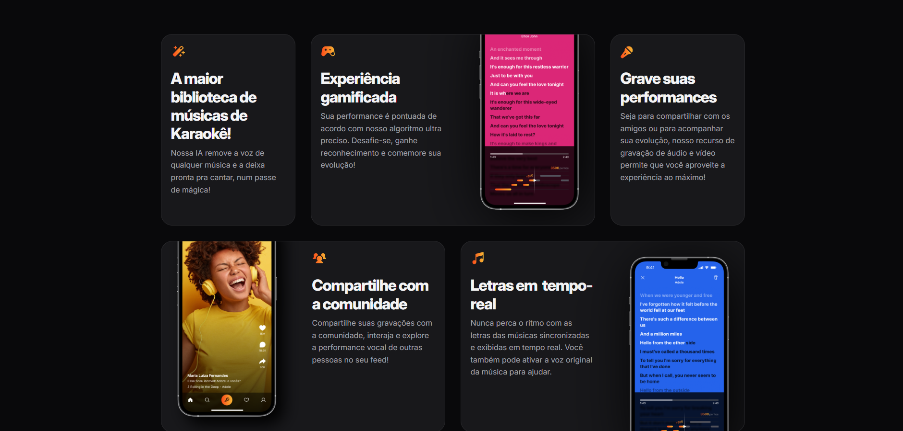
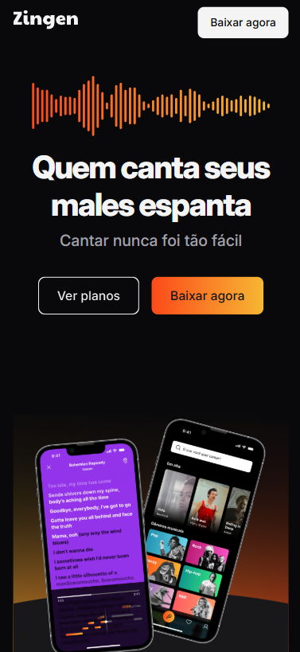
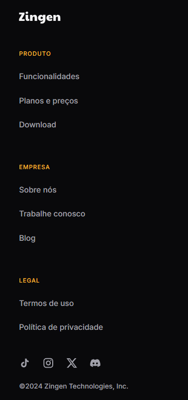

# Landing Page Mobile

Projeto de uma **landing page com foco em dispositivos mobile**, desenvolvido como prática durante meus estudos de **HTML e CSS**.

## Imagens do Projeto

### Tela inicial

### Seção da página-1

### Seção da página-2

### Seção da página-3

### Versão mobile

## Visualizar o projeto

Você pode acessar o projeto funcionando aqui:

🔗 https://vitormanoeldossantossilva0.github.io/projeto-lading-page-mobile/

## Tecnologias utilizadas

- HTML5  
- CSS3  

## Sobre

Esse projeto foi criado como parte dos meus estudos em **desenvolvimento front-end**, com o objetivo de praticar:

- Estruturação de páginas com HTML  
- Estilização com CSS  
- Layout pensado para dispositivos móveis  

## Observação

Projeto desenvolvido para fins de **aprendizado e prática**.
